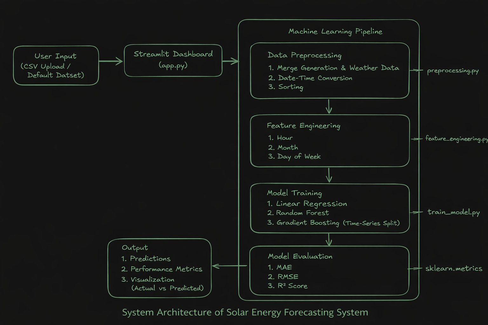

# Solar Energy Forecasting System  
### Machine Learning–Based Solar Energy Forecasting Dashboard


🔗 **Live Application:**  
https://solar-energy-forecasting-genai.streamlit.app/

---

## 📘 Project Overview

This project presents a **Machine Learning-based Solar Energy Forecasting Dashboard** designed to predict solar power generation (`DC_POWER`) using historical plant generation data and weather sensor readings.

Accurate solar forecasting plays a crucial role in:

- Grid stability  
- Renewable energy integration  
- Energy scheduling  
- Efficient power management  

The system applies supervised regression models and provides an interactive **Streamlit dashboard** for training, evaluation, and visualization.

---

## 🎯 Objective

To build a supervised regression system that predicts solar DC power output using:

- Irradiation  
- Ambient Temperature  
- Module Temperature  
- Time-based features (Hour, Month, Day of Week)  

---

## 🏗️ System Architecture



The system workflow consists of:

1. User Input (CSV Upload / Default Dataset)  
2. Streamlit Dashboard (`app.py`)  
3. Machine Learning Pipeline:
   - Data Preprocessing  
   - Feature Engineering  
   - Model Training  
   - Model Evaluation  
4. Output Visualization  
5. Cloud Deployment (Streamlit Community Cloud)  

---

## ⚙️ Technology Stack

| Component | Technology |
|------------|------------|
| Programming Language | Python |
| Data Processing | Pandas, NumPy |
| Machine Learning | Scikit-Learn |
| Models Used | Linear Regression, Random Forest, Gradient Boosting |
| Visualization | Matplotlib |
| UI Framework | Streamlit |
| Deployment | Streamlit Community Cloud |

---

## 📊 Dataset Description

The dataset contains:

### 🔹 Solar Generation Data
- DC_POWER  
- AC_POWER  
- DAILY_YIELD  
- TOTAL_YIELD  

### 🔹 Weather Sensor Data
- IRRADIATION  
- AMBIENT_TEMPERATURE  
- MODULE_TEMPERATURE  

### 🔹 Time Information
- DATE_TIME  

After merging and preprocessing:
- ~68,000 records  
- Time-series based split (80% train, 20% test)  

---

## 🔍 Feature Engineering

Extracted time-based features:

- Hour of Day  
- Month  
- Day of Week  

These features help capture daily and seasonal solar generation trends.

---

## 🤖 Model Training & Evaluation

Three regression models were implemented:

1. Linear Regression  
2. Random Forest Regressor  
3. Gradient Boosting Regressor  

Time-series split was used to prevent data leakage.

### 📈 Performance Comparison

| Model | MAE | RMSE | R² Score |
|--------|------|-------|-----------|
| Linear Regression | 282.99 | 593.91 | 0.9748 |
| Random Forest | 180.46 | 540.20 | 0.9791 |
| Gradient Boosting | **169.16** | **532.83** | **0.9797** |

✅ **Best Model:** Gradient Boosting Regressor  

The high R² score (~0.98) indicates strong predictive performance.

---

## 📱 Application Features

The Streamlit dashboard contains four main sections:

### 📘 About  
Explains project objective, architecture, and methodology.

### 📂 Preview  
- Dataset overview  
- Column summary  
- Interactive preview  

### 🚀 Train  
- Model selection  
- Interactive training  

### 📊 Evaluate  
- MAE, RMSE, R² metrics  
- Actual vs Predicted visualization  

---

## 📂 Project Structure

### 🔹 Core Application
- `app.py` – Streamlit dashboard interface  
- `requirements.txt` – Dependency list  

### 🔹 Data
- `data/Plant_1_Generation_Data.csv`  
- `data/Plant_1_Weather_Sensor_Data.csv`  

### 🔹 Machine Learning Modules (`utils/`)
- `preprocessing.py` – Data merging & cleaning  
- `feature_engineering.py` – Feature creation  
- `train_model.py` – Model training and evaluation  

### 🔹 Models
- `models/plant1_model.pkl` – Saved trained model  

### 🔹 Assets
- `assets/architecture.png` – System architecture diagram  

---

## 🚀 How to Run Locally

### 1️⃣ Clone the repository
```bash
git clone <your-repo-link>
cd <repo-name>
```

### 2️⃣ Install dependencies
```bash
pip install -r requirements.txt
```

### 3️⃣ Run the Streamlit app
```bash
streamlit run app.py
```

---

## 🌐 Deployment

The application is deployed using **Streamlit Community Cloud** and is publicly accessible.

🔗 https://solar-energy-forecasting-genai.streamlit.app/

---

## 👥 Team Members

- Ritik (2401010385)  
- Aman (2401010060)  
- Dev Kothari (2401010147)  
- Deepanshu Chaudhary (2401010145)  

---

## 📜 License

This project is licensed under the **MIT License**.
